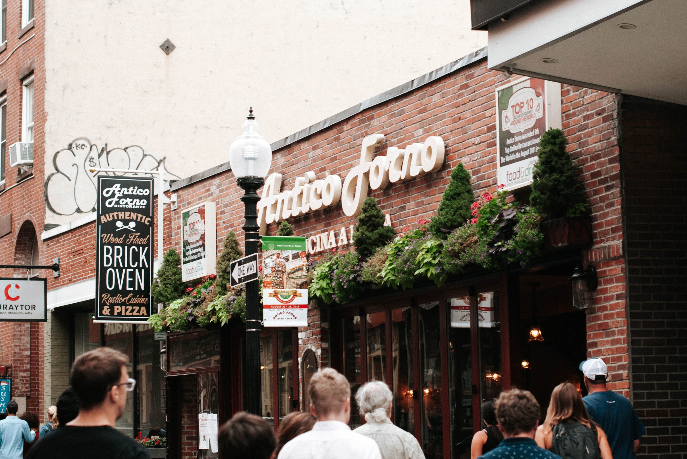
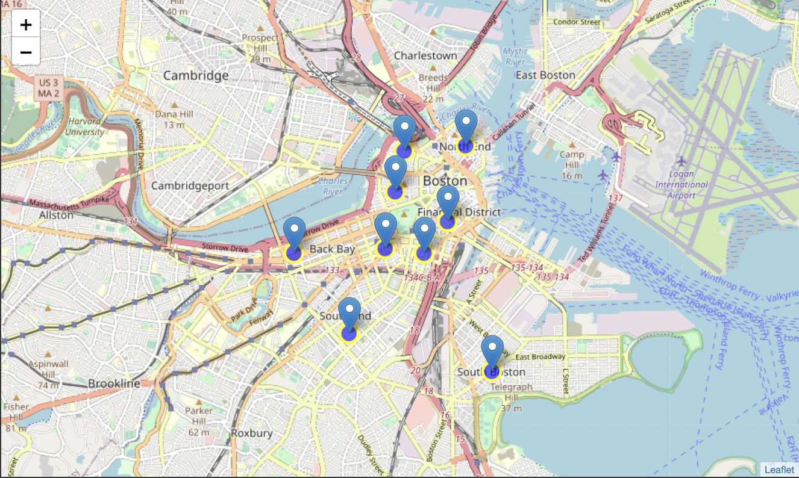

# Italian Restaurant Reviews in Boston

This project will list and visualize the amazing Italian restaurants in the city of Boston.

Photo by <a href="https://unsplash.com/@octoberroses?utm_source=unsplash&amp;utm_medium=referral&amp;utm_content=creditCopyText">Aubrey Odom</a> on <a href="https://unsplash.com/?utm_source=unsplash&amp;utm_medium=referral&amp;utm_content=creditCopyText">Unsplash</a>

___
### Data
- Boston neighborhood latitude and longitude information comes from a csv file which was compiled by googling the individual areas.
- Italian restaurant in each neighborhood comes from FourSquare API
- GeoJSON data for Folium map comes from Boston Open Data.

> “The trouble with eating Italian food is that five or six days later you’re hungry again.” - George Miller
___
### Approach
- By collecting the data from Boston Open Data and using FourSquare API we will find all venues for each neighborhood.
- Filter out all venues that are Italian restaurants.
- Find ratings, tips, and like count for each Italian restaurant using FourSquare API.
- Using rating for each restaurant, we will sort the data.
- Visualizing the rankings of each neighborhood using Folium.

> “Ideas are like pizza dough, made to be tossed around.” - Anna Quindlen
___
### Questions
- What area has the most Italian restaurants in Boston?
- Which areas lack Italian restaurants?
- Which areas would be best to visit if you want quality Italian cuisine?

> "Life is too short, and I'm Italian. I'd much rather eat pasta and drink wine than be a size 0." - Sophia Bush

___
### Import Libraries for Analysis
- Pandas and Numpy for handling the data <code></code>
<code></code>
- Request for using FourSquare API <code></code>
- GeoPy to get coordinates of Boston <code></code>
- Folium to visualize the maps <code></code>

___
### Samples from the Jupyter Notebook
<code></code>
<code></code>

___
### What's Next?
 <a href="https://www.google.com/search?tbs=lf:1,lf_ui:9&tbm=lcl&sxsrf=ALeKk01eJdrHd1alDYkcWsl1cBJB9BF9qg:1612661339652&q=italian+restaurants+boston&rflfq=1&num=10&sa=X&ved=2ahUKEwilv6vSz9buAhUYHM0KHSBGCoAQjGp6BAgBEGQ&biw=942&bih=848#rlfi=hd:;si:;mv:[[42.39251867875698,-71.02605035295208],[42.30320452859675,-71.1158272414418],null,[42.34787746592759,-71.07093879719696],13]">Plan a route</a> and hit up all the Italian restaurants in Boston 
  
 Read about the history of <a href="https://en.wikipedia.org/wiki/History_of_Italian_Americans_in_Boston">Italians in Boston</a>

___

Photo by <a href="https://unsplash.com/@michaelwb?utm_source=unsplash&amp;utm_medium=referral&amp;utm_content=creditCopyText">Michael Browning</a> on <a href="https://unsplash.com/?utm_source=unsplash&amp;utm_medium=referral&amp;utm_content=creditCopyText">Unsplash</a>
